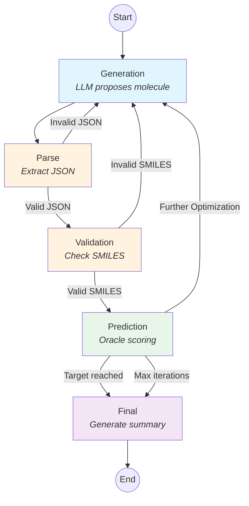

# Molecule Optimization Agent

LLM-driven molecular optimization using LangGraph. The agent iteratively proposes molecules, evaluates them with oracles, and optimizes toward a specified objective.

## Workflow



## Installation

This project uses [Pixi](https://pixi.prefix.dev/latest/installation/) for dependency management.

```bash
# Clone and install with pixi
cd molecule-optimization-agent
pixi install
```
## Environment Variables

Set your API key before running:
```bash
export OPENAI_API_KEY=sk-...
```

For custom API endpoints (e.g., corporate proxies), optionally set:
```bash
export OPENAI_BASE_URL=https://custom-endpoint.example.com/v1
```

Or use a `.env` file in the project root (loaded automatically):
```
OPENAI_API_KEY=sk-...
OPENAI_BASE_URL=https://custom-endpoint.example.com/v1  # Optional
```

## Usage

### Command Line

```bash
pixi run molopt --config config/experiments/<your_experiment>.yaml  
# e.g.: pixi run molopt --config config/experiments/similarity.yaml
```

### Interactive UI

Launch the Gradio web interface for interactive molecule optimization:

```bash
pixi run molopt-ui
```

The UI runs at `http://127.0.0.1:7860` and supports:
- **Similarity + QED**: Optimize for structural similarity to a target molecule while maintaining drug-likeness
- **IC50 MPro + QED + Novelty**: Optimize for SARS-CoV-2 MPro inhibition with drug-likeness and novelty constraints

You can provide feedback after each optimization round to guide the agent toward desired molecular properties.

## Reproducing Paper Results

All experiments from the paper can be reproduced using the shell scripts in the `scripts/` folder. Each script contains configurable hyperparameters at the top of the file.

### Experiment Scripts

| Script | Description |
|--------|-------------|
| `run_quercetin.sh` | XAI ablation experiments optimizing for Quercetin similarity + QED |
| `run_similarity_qed_pubchem_experiments.sh` | Similarity + QED optimization for 20 random PubChem molecules |
| `run_tdc_tasks_experiments.sh` | PMO benchmark tasks (rediscovery, similarity, isomers, MPO, etc.) |
| `run_ic50_mpro.sh` | IC50 MPro inhibition experiments with QED and novelty constraints |

### Running Experiments

```bash
# Make scripts executable
chmod +x scripts/*.sh

# Run an experiment (e.g., Quercetin XAI ablation)
./scripts/run_quercetin.sh
```

### Baseline Comparisons

Scripts for downloading and running baseline comparisons are in `scripts/baselines/`:

| Script | Description |
|--------|-------------|
| `download_pmo_results.py` | Download PMO benchmark baseline results |
| `reinvent_quercetin_sim_qed.py` | REINVENT baseline for Quercetin optimization |
| `reinvent_random_molecules_sim_qed.py` | REINVENT baseline for random PubChem molecules |
| `tdc_top_50_molecules.py` | TDC top-50 molecules baseline |

### Analysis Notebooks

Jupyter notebooks for analyzing results and generating paper figures are in `analysis/paper/`.

## Configuration

Experiments are defined in YAML config files. Example (`config/experiments/similarity_qed.yaml`):

```yaml
experiment_name: similarity_qed_optimization

log_dir: data/runs
recursion_limit: 150

llm:
  model: claude-sonnet-4-20250514
  temperature: 0.3

oracle:
  name: composite
  params:
    oracles:
      - name: similarity
        params:
          target_smiles: O=C1c3c(O/C(=C1/O)c2ccc(O)c(O)c2)cc(O)cc3O  # Quercetin
      - name: qed
        params: {}
    weights: [0.5, 0.5]
    names: ["Similarity", "QED"]

objective:
  name: similarity_qed
  params:
    target_score: 0.75
    min_similarity: 0.7
    min_qed: 0.7
    max_iterations: 30
```

This example optimizes for molecules similar to Quercetin while maintaining drug-likeness (QED).

## Output

Results are saved to `log_dir` as JSON files containing:

| Key | Description |
|-----|-------------|
| `timestamp` | Run timestamp (YYYYMMDD_HHMMSS) |
| `experiment` | Experiment name from config |
| `conversation` | Full message history (role + content) |
| `trace` | List of iterations with SMILES, scores, and reasoning |
| `iterations` | Total iteration count |
| `summary` | LLM-generated summary of the optimization |

## Project Structure

```
molecule-optimization-agent/
├── src/molopt_agent/       # Main package
│   ├── main.py             # CLI entry point
│   ├── config.py           # YAML config loading
│   ├── state.py            # LangGraph state definition
│   ├── graph/              # LangGraph workflow (nodes, routing, builder)
│   ├── oracles/            # Scoring functions (QED, similarity, IC50, etc.)
│   ├── objectives/         # Optimization objectives and feedback logic
│   └── ui/                 # Gradio web interface
├── config/experiments/     # Experiment YAML configs
├── scripts/                # Helper scripts for running experiments
├── analysis/               # Jupyter notebooks for result analysis
└── data/                   # Results and datasets
```

## Extending the Agent

### Adding a Custom Oracle

1. Create `oracles/my_oracle.py`:

```python
from .base import OracleResult

class MyOracle:
    def __init__(self, param1: str):
        self.param1 = param1

    def __call__(self, smiles: str) -> OracleResult:
        score = ...  # Your scoring logic
        return {"score": score, "explanation": ""}
```

2. Register in `oracles/__init__.py`:

```python
ORACLE_REGISTRY["my_oracle"] = MyOracle
```

### Adding a Custom Objective

1. Create `objectives/my_objective.py`:

```python
from ..state import WorkflowState
from ..oracles.base import Oracle, OracleResult

class MyObjective:
    name = "my_objective"

    def __init__(self, oracle: Oracle, target: float, max_iterations: int):
        self.oracle = oracle
        self.target = target
        self._max_iterations = max_iterations

    def first_message(self) -> str:
        return f"Optimize to target {self.target}. Respond with JSON: {{\"reason\": ..., \"smiles\": ...}}"

    def evaluate(self, state: WorkflowState) -> OracleResult:
        return self.oracle(state["current_smiles"])

    def build_feedback(self, state: WorkflowState, result: OracleResult) -> str:
        return f"Score: {result['score']:.2f}. Propose next molecule as JSON."

    def is_done(self, state: WorkflowState, result: OracleResult) -> bool:
        return result["score"] >= self.target or state["iteration_count"] >= self._max_iterations

    def max_iterations(self) -> int:
        return self._max_iterations
```

2. Register in `objectives/__init__.py`:

```python
OBJECTIVE_REGISTRY["my_objective"] = MyObjective
```

## Available Oracles

| Oracle | Description |
|--------|-------------|
| `qed` | Drug-likeness (QED score) |
| `similarity` | Tanimoto similarity to a target molecule |
| `ic50mpro` | SARS-CoV-2 MPro IC50 prediction |
| `novel` | PubChem novelty check |
| `opioid_ki` | Opioid receptor Ki prediction |
| `tdc_tasks` | TDC benchmark tasks |
| `composite` | Combines multiple oracles with weights |

## Available Objectives

| Objective | Description |
|-----------|-------------|
| `qed` | Maximize QED score |
| `similarity` | Match target molecule structure |
| `similarity_qed` | Multi-objective: similarity + drug-likeness |
| `ic50mpro` | Minimize IC50 against MPro |
| `ic50mpro_novel` | IC50 + novelty constraint |
| `ic50mpro_qed_novel` | IC50 + QED + novelty |
| `opioid_ki` | Minimize opioid receptor Ki |
| `tdc_tasks` | TDC benchmark optimization |
