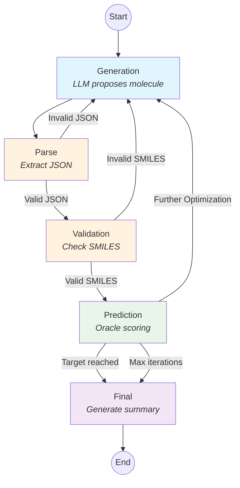

# Molecule Optimization Agent

LLM-driven molecular optimization using LangGraph. The agent iteratively proposes molecules, evaluates them with oracles, and optimizes toward a specified objective.

## Workflow



## Installation

```bash
# Clone and install with pixi
cd molecule-optimization-agent
pixi install
```
## Environment Variables

Set your API key before running:
```bash
export OPENAI_API_KEY=sk-...
```

Or use a `.env` file in the project root (loaded automatically):
```
OPENAI_API_KEY=sk-...
```

## Usage

```bash
pixi run molopt --config config/experiments/<your_experiment>.yaml  
# e.g.: pixi run molopt --config config/experiments/opioid_ki.yaml
```

## Configuration

Experiments are defined in YAML config files. Example (`config/experiments/opioid_ki.yaml`):

```yaml
experiment_name: delta_ki_baseline

log_dir: data/runs
recursion_limit: 100

llm:
  model: gpt-5.1
  temperature: 0.3
  api_key_env: OPENAI_API_KEY
  base_url: https://custom-endpoint.example.com/v1  # Optional. Add this keyword with url for Bayer here if you use internal model

oracle:
  name: opioid_ki
  params:
    model_name: fabikru/molencoder-D3R-simple

objective:
  name: opioid_ki
  params:
    target_ki_nM: 10.0
    max_iterations: 20
```

### Custom LLM Endpoint

For corporate API proxies, add `base_url` under `llm`. If omitted, the default OpenAI endpoint is used.

## Output

Results are saved to `log_dir` as JSON files with the following structure:

| Key | Description |
|-----|-------------|
| `timestamp` | Run timestamp (YYYYMMDD_HHMMSS) |
| `experiment` | Experiment name from config |
| `conversation` | Full message history (role + content) |
| `trace` | List of iterations with SMILES, scores, and reasoning |
| `iterations` | Total iteration count |
| `summary` | LLM-generated summary of the optimization |

Console output shows the best molecule, iteration count, and summary.

## Project Structure

```
src/molopt_agent/
├── main.py              # Entry point
├── config.py            # Config dataclasses and YAML loading
├── state.py             # LangGraph workflow state definition
├── system_prompt.py     # Fixed system prompt for the LLM
├── save_experiment.py   # Results saving logic
├── cli/                 # Argument parsing
├── graph/               # LangGraph workflow
│   ├── builder.py       # Graph construction
│   ├── nodes.py         # Node functions (generation, parsing, validation, prediction)
│   └── routing.py       # Conditional routing logic
├── oracles/             # Scoring functions
│   ├── base.py          # Oracle protocol
│   ├── opioid_ki.py     # Ki prediction oracle
│   ├── pubchem_novelty.py   # PubChem novelty oracle
│   ├── qed.py           # QED (drug-likeness) oracle
│   └── tanimoto_similarity.py  # Tanimoto similarity oracle
└── objectives/          # Optimization objectives
    ├── base.py          # Objective protocol
    ├── opioid_ki.py     # Opioid Ki minimization objective
    ├── pubchem_novelty.py   # PubChem novelty objective
    ├── qed.py           # QED maximization objective
    └── tanimoto_similarity.py  # Tanimoto similarity objective
```

## Adding Custom Oracles

1. Create a new file in `oracles/`, e.g. `oracles/my_oracle.py`:

```python
from .base import OracleResult

class MyOracle:
    def __init__(self, param1: str, param2: float):
        # Initialize your model/scorer
        pass

    def __call__(self, smiles: str) -> OracleResult:
        score = ...  # Your scoring logic
        return {
            "score": score,
            "explanation": f"Score: {score:.2f}",
        }
```

2. Register it in `oracles/__init__.py`:

```python
from .my_oracle import MyOracle

ORACLE_REGISTRY: Dict[str, Type[Oracle]] = {
    "opioid_ki": MolEncoderOpioidKiOracle,
    "my_oracle": MyOracle,  # Add here
}
```

3. Use in config:
```yaml
oracle:
  name: my_oracle
  params:
    param1: "value"
    param2: 1.5
```

## Adding Custom Objectives

1. Create a new file in `objectives/`, e.g. `objectives/my_objective.py`:

```python
from ..state import WorkflowState
from ..oracles.base import Oracle, OracleResult

class MyObjective:
    name = "my_objective"

    def __init__(self, oracle: Oracle, target: float, max_iterations: int):
        self.oracle = oracle
        self.target = target
        self._max_iterations = max_iterations

    def first_message(self) -> str:
        return f"Optimize molecules to achieve target {self.target}. Respond with JSON: {{\"reason\": ..., \"smiles\": ...}}"

    def evaluate(self, state: WorkflowState) -> OracleResult:
        return self.oracle(state["current_smiles"])

    def build_feedback(self, state: WorkflowState, result: OracleResult) -> str:
        return f"Score: {result['score']:.2f}. Target: {self.target}. Propose next molecule as JSON."

    def is_done(self, state: WorkflowState, result: OracleResult) -> bool:
        return result["score"] < self.target or state["iteration_count"] >= self._max_iterations

    def max_iterations(self) -> int:
        return self._max_iterations
```

2. Register it in `objectives/__init__.py`:

```python
from .my_objective import MyObjective

OBJECTIVE_REGISTRY: Dict[str, Type[Objective]] = {
    "opioid_ki": OpioidKiObjective,
    "my_objective": MyObjective,  # Add here
}
```

3. Use in config:
```yaml
objective:
  name: my_objective
  params:
    target: 5.0
    max_iterations: 30
```


